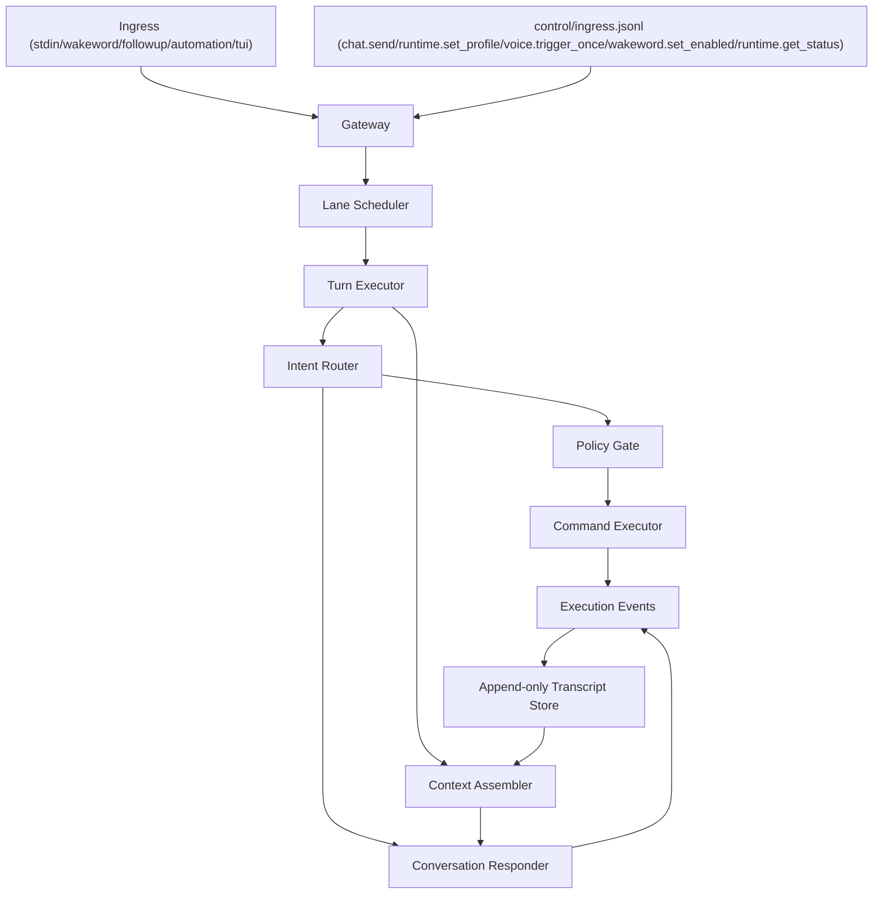

# Herzen v1 Architecture Spec

Status: Proposed  
Last updated: 2026-03-01  
Applies to: `@herzen/core`, `@herzen/dialog`, `@herzen/integration-homeassistant`

## 1) Goal

Define a scalable but low-complexity architecture for:

1. Context control (assembly, compaction, isolation)
2. Intent engine (detect actionable skill/task intent and map to API commands)
3. Safe execution routing (commands vs conversational LLM response)

This spec is the next-stage target architecture. It is designed to evolve from the current deterministic HA-first + LLM fallback runtime without large rewrites.

## 2) Design Constraints

1. Local-first, offline-capable by default
2. Append-only event history as source of truth
3. Deterministic command contracts before model-dependent behavior
4. Per-session and per-lane isolation to avoid race conditions
5. Explicit policy gate before any side effects
6. Provider-agnostic model interfaces (Apple Foundation Models are adapters, not architecture)

## 3) Scope

### In scope

1. Control plane interfaces and runtime flow
2. Intent engine pipeline and confidence policy
3. Command schema and validation lifecycle
4. Lane scheduler and queue policy
5. Context assembly and compaction policy
6. Replay/observability requirements

### Out of scope (v1)

1. Full plugin marketplace/runtime
2. Distributed multi-host queue
3. Long-term vector memory as required dependency
4. UI redesign across mobile/web/desktop channels

## 4) Target System Topology



## 5) Core Components

### 5.1 Gateway

Normalizes incoming events into a single internal envelope and assigns:

1. `sessionId`
2. `laneKey`
3. `traceId`
4. `source` (`stdin`, `wakeword`, `followup`, `automation`, `tui`)

### 5.2 Lane Scheduler

Provides ordering and collision control.

Rules:

1. Serialize jobs within a lane (`concurrency = 1`)
2. Allow bounded concurrency across lanes
3. Preserve FIFO ordering per lane
4. Surface backpressure metrics (queue depth, wait time)

Suggested default lane keys:

1. `session:<id>:trigger`
2. `session:<id>:followup`
3. `session:<id>:automation`
4. `integration:homeassistant`

### 5.3 Turn Executor

Orchestrates one turn from transcript to either:

1. Command execution path
2. Conversational response path

### 5.4 Intent Router

Four-stage pipeline:

1. Deterministic parser (existing phrase/entity parser and explicit commands)
2. Actionability classifier (actionable vs conversational)
3. Command extractor (structured arguments)
4. Validator (schema + policy + auth scope)

Routing outcomes:

1. `execute`
2. `clarify`
3. `respond`
4. `reject`

### 5.5 Context Assembler

Builds bounded context payload per turn from deterministic slices:

1. Kernel prompt/policy
2. Session summary
3. Recent turns
4. Retrieved memory facts
5. Current user input

### 5.6 Policy Gate

Final safety checkpoint before side effects:

1. Command allowlist
2. Argument schema validation
3. Scope checks (filesystem, network, integration)
4. Idempotency-key de-duplication

### 5.7 Transcript Store

Append-only JSONL event log. Every decision, command, output, and error is recorded with causal IDs.

## 6) Canonical Data Contracts

These contracts are mandatory and versioned.

```ts
export interface IntentRecordV1 {
  schemaVersion: "intent.v1";
  intentId: string;
  sessionId: string;
  turn: number;
  source: "deterministic" | "model";
  route: "execute" | "clarify" | "respond" | "reject";
  actionable: boolean;
  confidence: number; // 0..1
  intentName?: string;
  entities?: Record<string, unknown>;
  modelProvider?: string;
  modelName?: string;
  ts: string;
}

export interface CommandEnvelopeV1 {
  schemaVersion: "command.v1";
  commandId: string;
  sessionId: string;
  turn: number;
  laneKey: string;
  name: string; // e.g. "homeassistant.light.turn_on"
  args: Record<string, unknown>;
  policyScope: string; // e.g. "ha:write"
  idempotencyKey: string;
  ts: string;
}

export interface ExecutionEventV1 {
  schemaVersion: "execution.v1";
  eventId: string;
  commandId?: string;
  sessionId: string;
  turn: number;
  phase:
    | "intent_detected"
    | "route_decided"
    | "command_validated"
    | "command_started"
    | "command_succeeded"
    | "command_failed"
    | "response_started"
    | "response_succeeded"
    | "response_failed";
  ok: boolean;
  code?: string;
  message?: string;
  details?: Record<string, unknown>;
  ts: string;
}

export interface ControlIngressEnvelopeV1 {
  schemaVersion: "control.ingress.v1";
  ingressId: string;
  sessionId: string;
  source: "tui" | "automation";
  command:
    | "chat.send"
    | "runtime.set_profile"
    | "voice.trigger_once"
    | "wakeword.set_enabled"
    | "runtime.get_status";
  payload:
    | { sessionId: string; text: string; source: "tui" | "automation" }
    | { profile: "voice" | "text" | "hybrid" }
    | { source?: "tui" | "automation" }
    | { enabled: boolean }
    | { includeDiagnostics?: boolean };
  traceId?: string;
  ts: string;
}

export interface MemoryEntryV1 {
  schemaVersion: "memory.v1";
  memoryId: string;
  sessionId: string;
  kind: "fact" | "preference" | "task" | "summary";
  content: string;
  tags: string[];
  sourceEventIds: string[];
  ttlSeconds?: number;
  ts: string;
}
```

## 7) Intent Engine Specification

### 7.1 Routing Policy

Given `transcript`:

1. Try deterministic parser first
2. If parser misses, run classifier
3. If classifier says conversational: route `respond`
4. If classifier says actionable: run extractor
5. Validate extracted command against schema/policy
6. Route based on confidence and validation result

### 7.2 Confidence Thresholds (v1 defaults)

1. `execute` when confidence >= `0.78` and validation passes
2. `clarify` when `0.55 <= confidence < 0.78` or required args missing
3. `respond` when confidence < `0.55` and no deterministic intent
4. `reject` when intent appears malicious/out-of-policy

Thresholds are config-driven and calibrated against replay datasets.

### 7.3 Apple Foundation Models Position

Apple Foundation Models are used behind a model adapter for:

1. Actionability classification
2. Structured command extraction

They are not the command authority. The authority is:

1. Schema validator
2. Policy gate
3. Executor allowlist

Provider abstraction interface:

```ts
export interface IntentModelAdapter {
  classifyActionability(input: { text: string; language?: string }): Promise<{
    actionable: boolean;
    confidence: number;
    reason?: string;
  }>;

  extractCommand(input: { text: string; language?: string }): Promise<{
    intentName?: string;
    args?: Record<string, unknown>;
    confidence: number;
    raw?: unknown;
  }>;
}
```

Required adapters:

1. `deterministic-only` (baseline, no ML dependency)
2. `apple-foundation` (preferred on supported macOS)
3. Optional fallback adapter for tests/simulation

## 8) Command Execution Specification

### 8.1 Command Registry

Use a typed registry; each command declares:

1. `name`
2. `zod/json-schema` arg validator
3. `policyScope`
4. `execute()` function
5. `sideEffectLevel` (`none`, `local`, `integration_write`)

### 8.2 Idempotency

Every command execution requires `idempotencyKey`.
Duplicate keys within a configured retention window must short-circuit and return prior result metadata.

### 8.3 Failure Behavior

On execution failure:

1. Emit `command_failed` event with typed error code
2. Produce user-safe response text
3. Keep full diagnostics in transcript event details

## 9) Context Control Specification

### 9.1 Context Slices and Budget

The context builder uses a fixed budget and deterministic slice ceilings.

Suggested initial token budget:

1. Total: 6000
2. Kernel: 900
3. Session summary: 1000
4. Recent turns: 2200
5. Retrieved memory: 1400
6. Current input reserve: 500

If tokenization is unavailable in a runtime path, fall back to character ceilings with conservative ratios.

### 9.2 Assembly Order

1. Kernel (immutable policy + response style constraints)
2. Active task/state facts
3. Session summary (derived artifact)
4. Retrieved memory entries
5. Recent raw turns (newest-first within slice, emitted oldest-to-newest)
6. Current transcript

### 9.3 Compaction Triggers

Compaction runs when any condition is true:

1. recent-turn slice overflow
2. N turns since last summary (default 6)
3. queue idle window reached (default 30s)

Compaction output:

1. Updated session summary
2. Optional promoted memory entries (`fact`, `preference`, `task`)
3. Pruned hot-context window

All compaction output references source event IDs.

### 9.4 Isolation Rules

1. Context is isolated per `sessionId`
2. Lane-local execution metadata is not shared unless promoted through memory rules
3. Automation/system lanes cannot inject hidden state into user chat context without explicit event traces

## 10) Security and Trust Boundaries

1. Localhost-only integrations by default
2. Explicit allowlists for integration operations
3. Filesystem root boundaries for any file tools
4. No raw tool stderr returned to user without sanitization
5. Policy decisions logged as first-class events

## 11) Observability and Replay

### 11.1 Event Streams

Store under `data/control/`:

1. `intent.jsonl`
2. `commands.jsonl`
3. `execution.jsonl`
4. session-scoped merged stream (`sessions/<sessionId>.jsonl`)

### 11.2 Replay Harness

Replay must support:

1. Input transcript sequence replay
2. Deterministic parser-only mode
3. Model-assisted mode with recorded outputs
4. Metric generation (false action rate, clarification rate, route latency)

## 12) Module Layout (v1)

Proposed files under `packages/core/src/`:

```txt
control/
  contracts.ts
  event_store.ts
  gateway.ts
  lanes.ts
  queue.ts
  policy_gate.ts
  command_registry.ts
  idempotency_store.ts
intent/
  router.ts
  deterministic_parser.ts
  classifier.ts
  extractor.ts
  validator.ts
  model_adapter.ts
  adapters/
    apple_foundation.ts
    deterministic_only.ts
context/
  assembler.ts
  budget.ts
  summary.ts
  compactor.ts
  memory_store.ts
```

Existing modules (`app/turn.ts`, `conversation/context_window.ts`, `conversation/journal.ts`) remain active and are incrementally migrated behind these interfaces.

## 13) Environment Configuration (proposed)

1. `HERZEN_INTENT_ENGINE_ENABLED=1`
2. `HERZEN_INTENT_PROVIDER=deterministic|apple_foundation`
3. `HERZEN_INTENT_EXECUTE_CONFIDENCE=0.78`
4. `HERZEN_INTENT_CLARIFY_CONFIDENCE=0.55`
5. `HERZEN_LANE_MAX_GLOBAL_CONCURRENCY=2`
6. `HERZEN_CONTEXT_TOKEN_BUDGET=6000`
7. `HERZEN_CONTEXT_SUMMARY_EVERY_TURNS=6`
8. `HERZEN_CONTROL_REPLAY_CAPTURE=1`

Defaults keep behavior compatible with current runtime when the new engine is disabled.

## 14) Migration Plan

### Phase A: Contracts + Eventing

1. Add v1 contracts and event streams
2. Keep existing deterministic HA path untouched
3. Emit mirrored intent/route events from current logic

### Phase B: Router + Policy Gate

1. Introduce intent router wrapper around existing HA parser
2. Add explicit route decisions (`execute`, `clarify`, `respond`, `reject`)
3. Add policy gate + command registry for HA commands

### Phase C: Context Assembler + Compaction

1. Replace direct `ConversationContextWindow` snapshot calls with context assembler
2. Add rolling summary store and compaction triggers
3. Keep append-only journals as source of truth

### Phase D: Apple FM Adapter + Calibration

1. Add Apple FM adapter for classifier/extractor
2. Run replay benchmark and tune thresholds
3. Enable model-assisted routing behind feature flag

## 15) Acceptance Criteria

1. No command side effect executes without schema + policy validation
2. Every turn has explicit route decision recorded
3. Replay from transcript reproduces route outcomes deterministically in deterministic mode
4. Context assembler enforces fixed budgets and deterministic ordering
5. Fallback to conversational response remains available when no valid intent exists

## 16) Primary Risks and Mitigations

1. Risk: model false positives trigger wrong actions  
   Mitigation: high execute threshold + policy gate + clarification band

2. Risk: context growth degrades latency and quality  
   Mitigation: strict budget slices + scheduled compaction

3. Risk: adapter lock-in to Apple stack  
   Mitigation: provider-neutral adapter interface and deterministic baseline path

4. Risk: concurrency races across voice/follow-up/automation  
   Mitigation: lane keys + FIFO per lane + idempotency keys
